# 基于springboot的社区医院管理系统

#### 介绍

随着社区医疗服务需求的不断增长，为了提高社区医院的服务质量和管理效率，我们开发了这套基于 Spring Boot 的社区医院管理系统。该系统旨在整合社区医疗资源，优化医疗服务流程，为社区居民提供更加便捷、高效、优质的医疗服务。

#### 技术栈

后端技术栈：Springboot+Mysql+Maven

前端技术栈：Vue+Html+Css+Javascript+ElementUI

开发工具：Idea+Vscode+Navicate

#### 系统功能介绍

（一）管理员角色  
个人中心：管理员可以在个人中心查看和修改自己的个人信息，以及系统操作记录和通知。  
管理员管理：对其他管理员的账号进行创建、修改、删除等操作，设置管理员的权限和职责。  
病例信息管理：全面管理患者的病例信息，包括病例的录入、查询、修改、统计分析等，为医疗诊断和研究提供数据支持。  
基础数据管理：维护系统所需的基础数据，如疾病分类、医疗项目、收费标准等。  
家庭医生管理：对家庭医生的信息进行登记、分配服务区域和服务对象，监督家庭医生的服务质量。  
健康档案管理：建立和管理社区居民的健康档案，包括基本健康信息、体检记录、疾病史等，实现居民健康状况的动态跟踪。  
就诊信息管理：管理患者的就诊记录，包括挂号信息、诊断结果、治疗方案等，便于对医疗服务进行评估和改进。  
前台管理：对前台工作人员的工作进行安排和监督，确保前台服务的高效和有序。  
药品管理：负责药品的采购、库存管理、药品信息维护、药品有效期监控等，保障药品的供应和质量安全。  
医生管理：对医生的信息进行登记、排班安排、绩效评估等，合理调配医疗人力资源。  
用户管理：管理社区居民的用户信息，包括用户注册审核、信息更新等，确保用户信息的准确性和完整性。  

（二）前台角色  
个人中心：前台工作人员在个人中心查看和修改个人信息，接收工作任务和通知。  
病例信息管理：协助查询和整理病例信息，为患者提供病例相关的服务。  
健康档案管理：更新和维护居民的健康档案，确保档案信息的及时性和准确性。  
就诊信息管理：处理患者的就诊流程，包括挂号、分诊等工作，并记录就诊信息。  
药品管理：协助管理药品库存，进行药品的盘点和出入库登记。  

（三）医生角色  
个人中心：医生在个人中心查看自己的工作安排、患者信息和绩效情况等。  
病例信息管理：详细记录患者的病情、诊断结果和治疗方案，为患者的后续治疗提供依据。  
健康档案管理：查阅患者的健康档案，全面了解患者的健康状况，为诊断和治疗提供参考。  
就诊信息管理：记录患者的就诊过程和治疗情况，方便跟踪患者的康复进展。  
药品管理：为患者开具药品处方，了解药品库存情况，确保用药的合理性和安全性。  

（四）用户角色  
个人中心：用户可以在个人中心查看自己的基本信息、就诊记录和健康档案。  
病例信息管理：查看自己的病例详情，了解病情和治疗过程。  
家庭医生管理：与家庭医生进行沟通和预约服务，获取个性化的医疗建议。  
健康档案管理：随时了解自己的健康状况变化，关注健康趋势。  
就诊信息管理：查询就诊安排和历史就诊信息，方便安排就医时间。  
药品管理：了解医生开具的药品信息和用药指导。  

#### 系统作用

该社区医院管理系统的主要作用是提升社区医院的管理效率，改善患者的就诊体验。具体作用如下：  

提高管理效率：通过系统化的管理，减少手工操作，提高医院各项工作的效率。  
改善患者体验：患者可以在线查看病例、健康档案、就诊记录，方便快捷。  
精准数据管理：系统对病例信息、健康档案、药品信息等进行全面管理，确保数据的准确性和完整性。  
增强沟通协作：家庭医生管理、就诊信息管理等功能，加强医生与患者之间的沟通和协作。  

#### 系统功能截图

代码结构

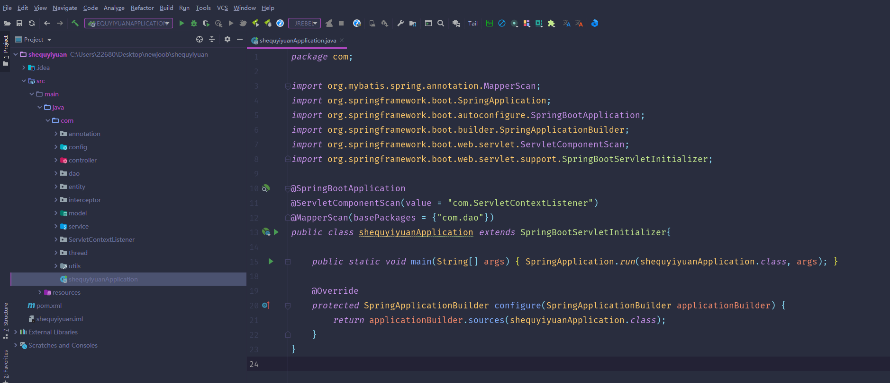

数据库表

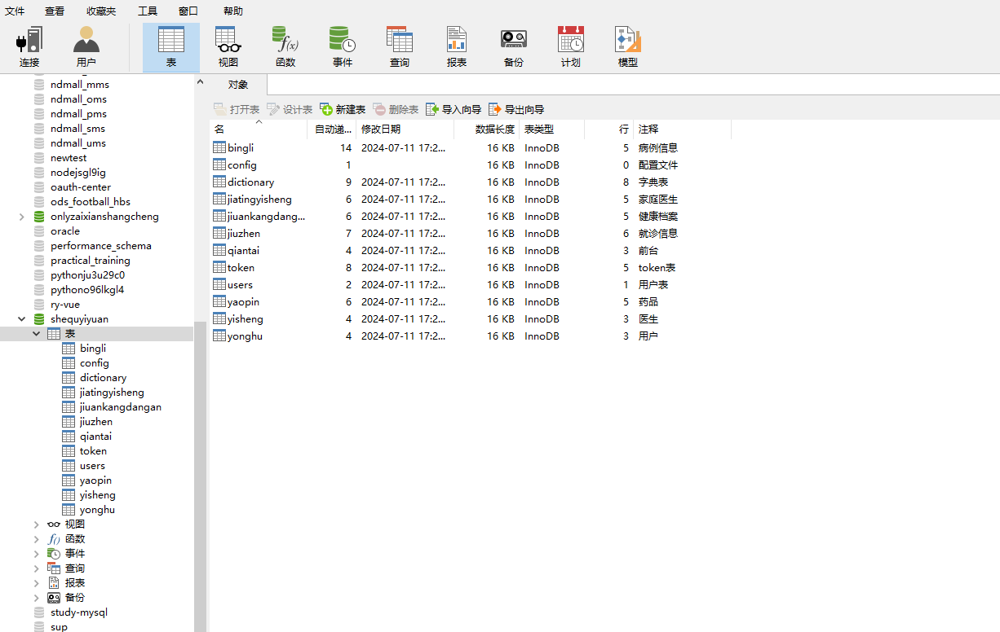

登录

管理信息管理

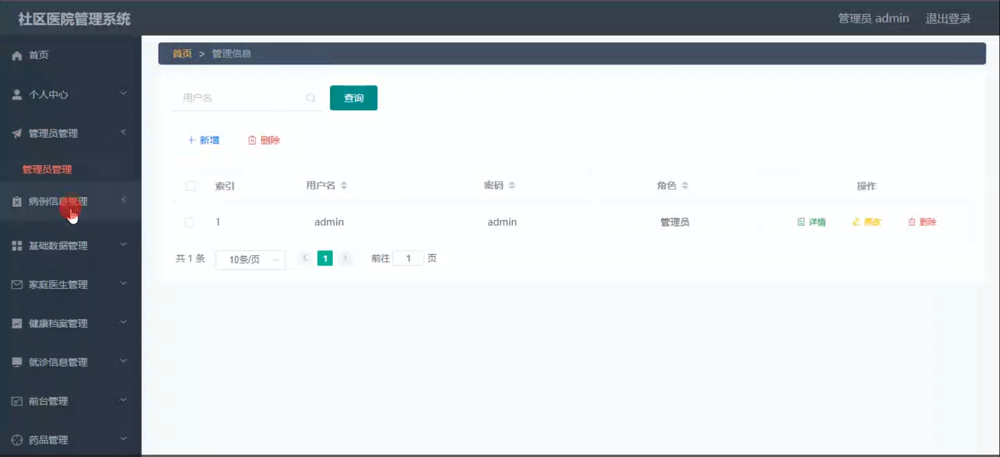

病例信息管理

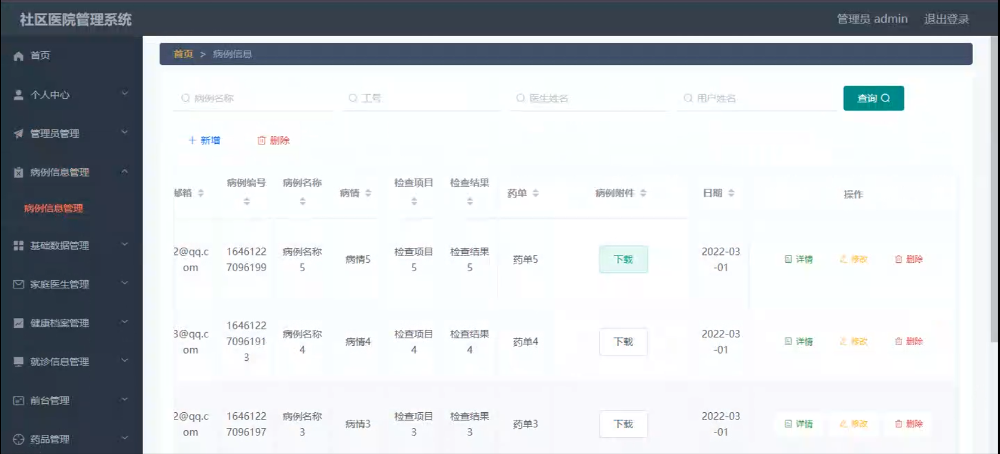

家庭医生管理

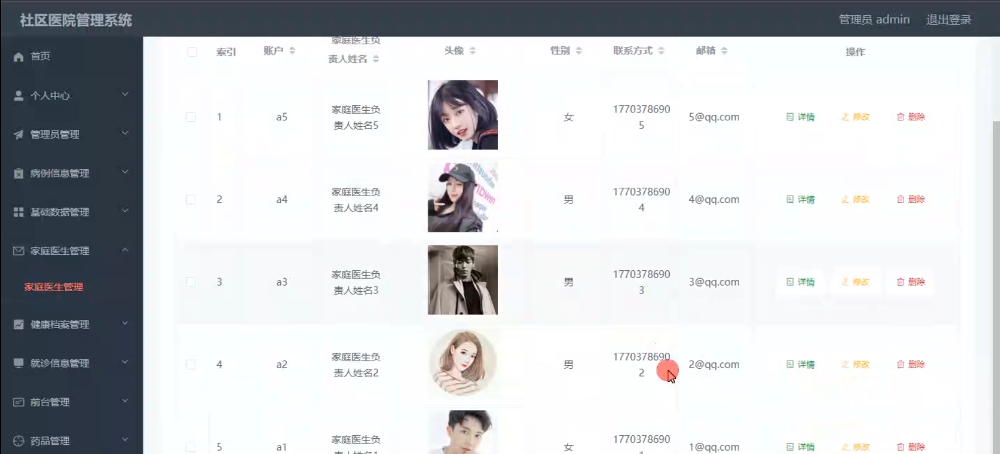

健康档案管理

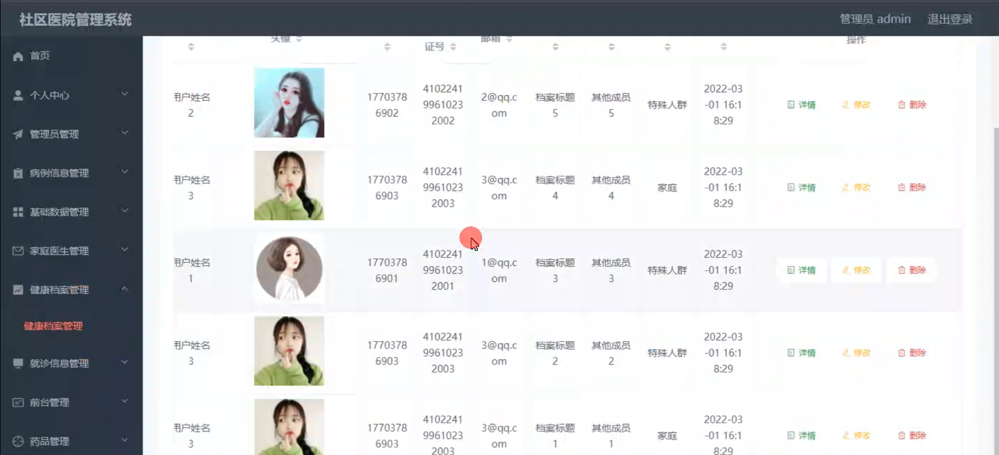

就诊信息管理

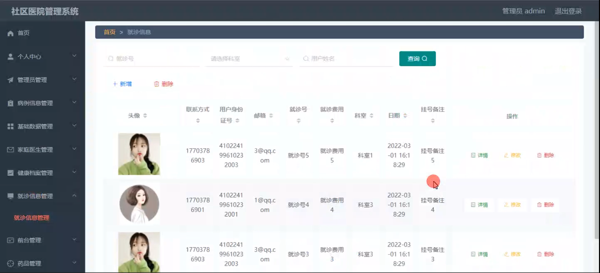

药品管理

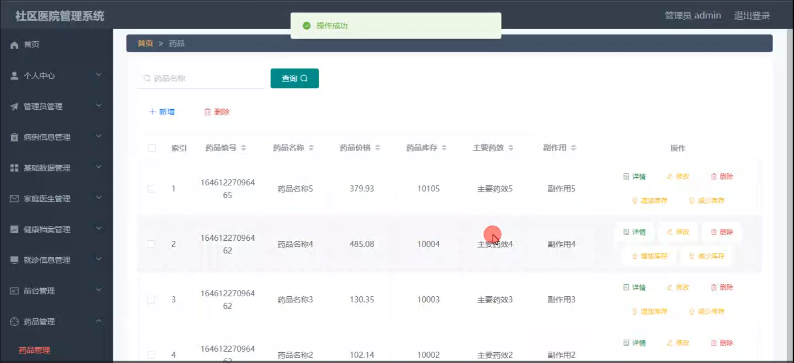

用户管理

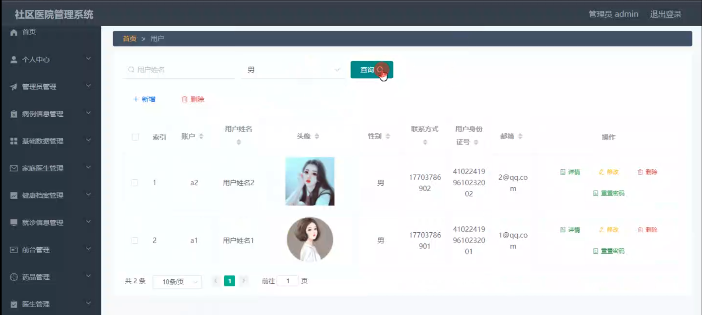

前台病例信息管理

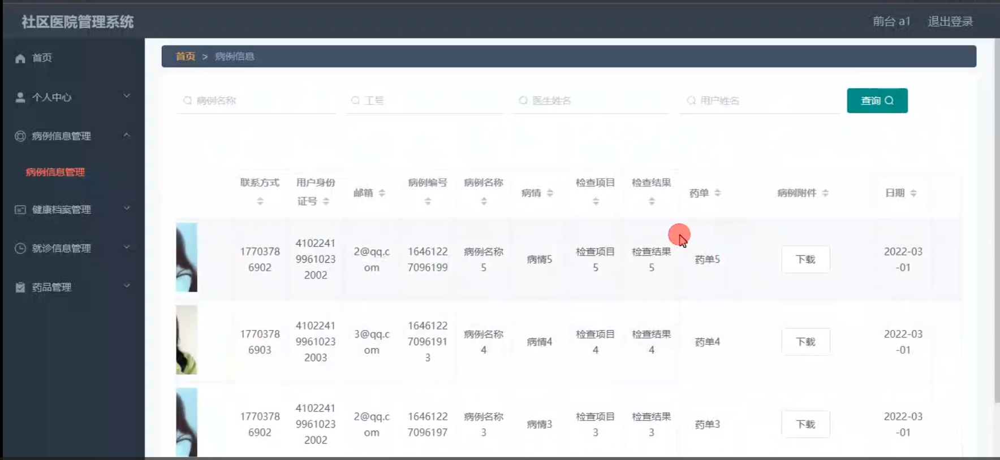

医生端病例信息信息

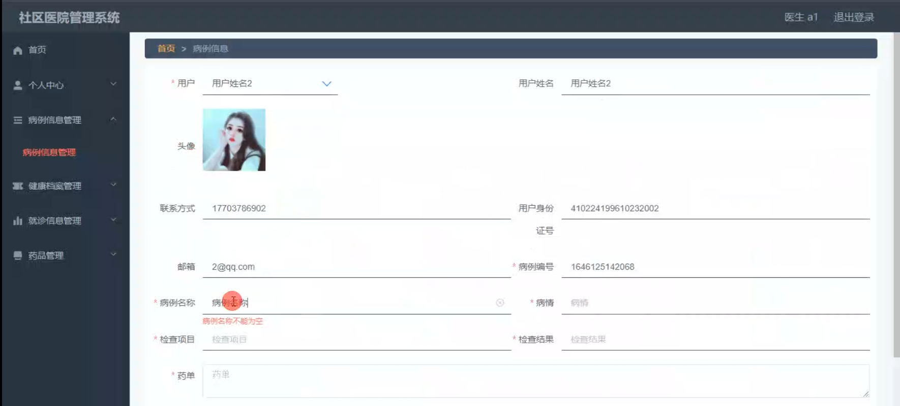

用户端个人信息

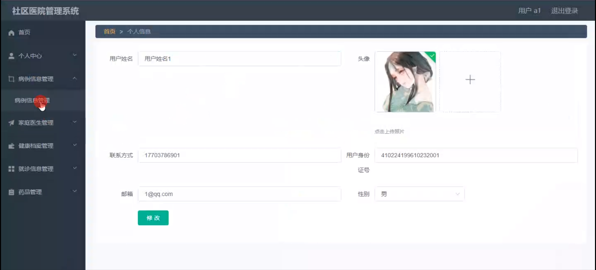

就诊信息管理

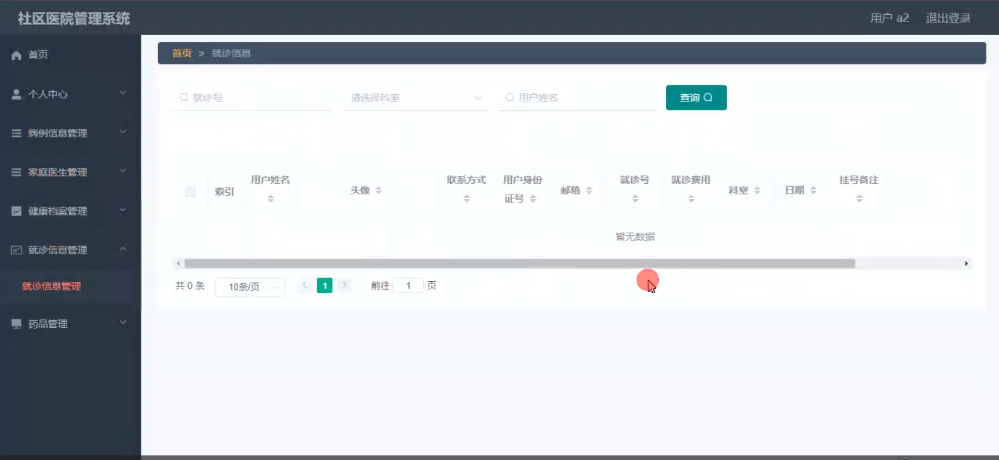

#### 总结

基于 Spring Boot 的社区医院管理系统，通过明确管理员、前台、医生和用户等不同角色的功能模块，实现了社区医院管理的信息化和规范化。该系统有助于提升社区医院的服务水平，满足居民日益增长的医疗需求，为社区医疗事业的发展提供有力支持。

#### 使用说明

创建数据库，执行数据库脚本 修改jdbc数据库连接参数 下载安装maven依赖jar 启动idea中的springboot项目

后台登录页面：http://localhost:8080/shequyiyuan/admin/dist/index.html

管理员				账户:admin 		密码：admin

前台				账户:a1 		密码：123456

医生				账户:a1 		密码：123456

用户				账户:a1 		密码：123456